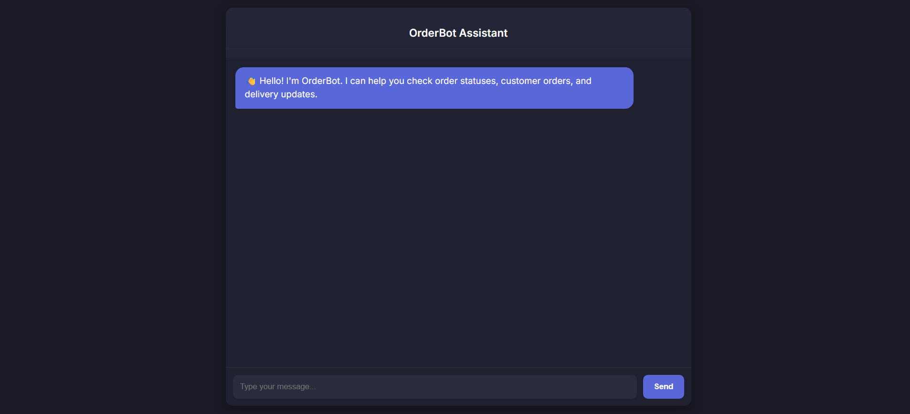
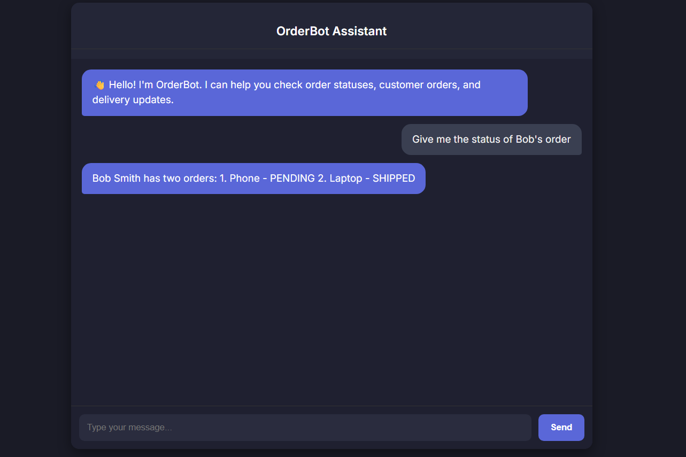

#  OrderBot – AI-Powered Order Tracking Assistant  
A full-stack AI assistant built using **FastAPI**, **React (Vite)** and **OpenRouter LLMs**.  
OrderBot helps users quickly retrieve **order details, status, customer info**, and more using natural language.


##  Features

### AI Capabilities
- Understands natural language queries  
- Extracts order parameters (order ID, customer name, date, etc.)  
- Responds with meaningful, context-aware answers  
- Uses **DeepSeek Chat** via OpenRouter API  

###  Order Data Handling
- Stores & retrieves order data from SQLite (`orders.db`)  
- Structured query logic using FastAPI  
- Flexible schema for demo datasets  

###  Frontend (React + Vite)
- Clean ChatGPT-like UI  
- Responsive design  
- Typing animation (“OrderBot is thinking…”)  
- API_ENV variables supported  

### Backend (FastAPI) 
- LLM parameter extraction  
- LLM answer generation  
 
## Tech Stack

### **Frontend**
- React (Vite)
- Axios
- CSS Responsive UI

### **Backend**
- FastAPI
- Uvicorn
- SQLAlchemy (optional)
- SQLite database

### **AI**
- OpenRouter API  
- DeepSeek 

## How to run
### Environment Variables
Create a `.env` in project root:
 Add
- OPENROUTER_API_KEY=your_key_here
- OPENROUTER_BASE_URL=https://openrouter.ai/api/v1/chat/completions
- LLM_MODEL=deepseek/deepseek-chat
- DATABASE_URL=sqlite:///./orders.db

For frontend (`frontend/.env`):
- Add
VITE_API_URL=http://localhost:8000/api

## 🧪 Run the Project Locally

### **1️⃣ Start backend**
```bash
cd orderbot
uvicorn api.main:app --reload --host 0.0.0.0 --port 8000
```

### **2️⃣ Start frontend**
```bash
cd frontend
npm install
npm run dev
```

## Screenshots
### 1. Chat UI



### 2. Bot test chat



## Author
- Abhishek Sahukar Srinivas

## License 
- MIT License